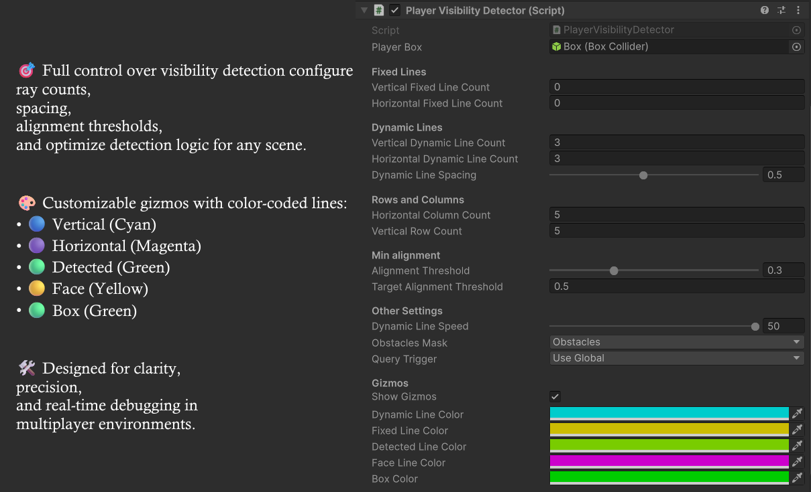

# 🔒 Anti-Wallhack Visibility System

### 🧠 Server-Side Visibility Detection for Unity Multiplayer Games

This Unity asset provides a robust system to detect player visibility and prevent wallhacks using server-side logic. Designed for competitive environments, it ensures that each player sees only what they should — nothing more.

---

## ⚙️ Features

- 🎯 **Observer-based Field of View (FOV)**  
  Calculates visibility using directional cones and raycasting logic.

- 🧠 **Optimized Detection**  
  Once a valid line reaches the target, only that path is calculated until visibility is lost.

- 🛠️ **Customizable Parameters**  
  Configure ray counts, spacing, alignment thresholds, and detection speed.

- 🎨 **Editor Gizmos**  
  Visualize detection logic in real time with color-coded gizmos:
  - 🔵 Vertical lines (Cyan)  
  - 🟣 Horizontal lines (Magenta)  
  - 🟢 Detected lines (Green)  
  - 🟡 Face lines (Yellow)  
  - ⚪ Box collider (White)

---

## 📦 Asset Store Submission

This repository supports the Unity Asset Store submission of the **Anti-Wallhack Visibility System**. All code and visual assets are original and authorized for commercial use.

---

## 📸 Screenshots

### 🎯 FOV Detection in Action

### 🛠️ Inspector Settings

### 🎨 Gizmo Visualization

### 🔍 Raycasting Grid

### 🧠 Optimized Detection Logic

---

## 📄 License

Commercial use authorized. All content is original and owned by the publisher.
